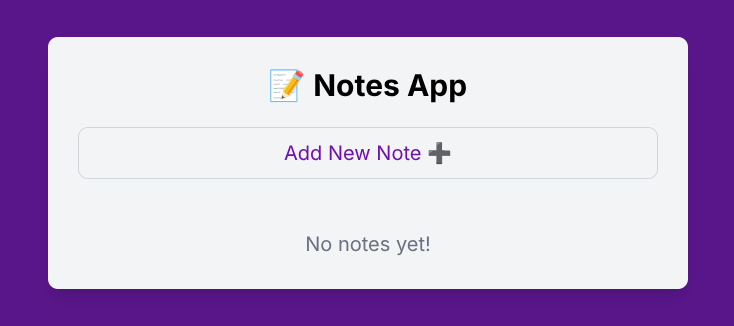
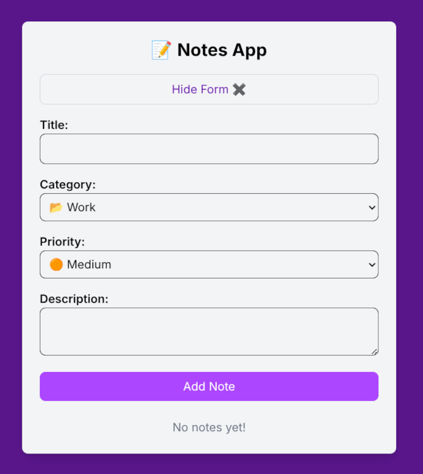

<h1 align="center">📘 Notes App</h1>

<p align="center">
  A clean and modular note-taking application built with <strong>React + Vite + TailwindCSS</strong>.
</p>

<p align="center">
  
  
  
  
</p>

---

## 🚀 Overview

This project represents **Phase 1** of a multi-stage Notes App.
It currently supports **adding, displaying, and deleting notes** along with **priority-based color indicators**.

The architecture is intentionally modular to support future features like:

- Editing notes
- Search & filters
- Drag & Drop
- Dark mode
- Cloud sync
- And more…

---

## ✨ Features (Phase 1)

- ➕ Add new notes
- 📂 Collapsible form for clean UX
- 💾 Auto-save using **localStorage**
- 🗑 Delete notes
- 🎨 Priority color indicators

  - 🔴 High
  - 🟠 Medium
  - 🟢 Low

- 🗃 Categories (Work / Personal / Ideas)
- ♻️ Reusable inputs (`TextInput`, `SelectInput`, `TextareaInput`)
- 💡 Clean UI built with TailwindCSS
- 📦 Scalable, maintainable React architecture

---

## 📂 Project Structure

```

src
├── App.jsx
├── assets/
├── components
│ ├── inputs/
│ │ ├── SelectInput.jsx
│ │ ├── TextareaInput.jsx
│ │ └── TextInput.jsx
│ ├── NoteForm.jsx
│ ├── Note.jsx
│ └── NoteList.jsx
├── index.css
└── main.jsx

```

> The file structure follows the standard **Vite + React** architecture.

---

## 🛠 Tech Stack

- **React 19**
- **Vite 7**
- **TailwindCSS 4**
- **JavaScript (ES6+)**
- **ESLint** with recommended rules

---

## 📦 Dependencies

### Dependencies

- react
- react-dom
- tailwindcss
- @tailwindcss/vite

### DevDependencies

- vite
- @vitejs/plugin-react
- eslint (with plugins)
- @types/react
- @types/react-dom

---

## ▶️ Getting Started

### 1️⃣ Install dependencies

```bash
npm install
```

### 2️⃣ Start development server

```bash
npm run dev
```

### 3️⃣ Build for production

```bash
npm run build
```

### 4️⃣ Preview build

```bash
npm run preview
```

---

## 🧱 Component Breakdown

### **NoteForm.jsx**

Collapsible form + form state handling.

### **NoteList.jsx**

Renders the collection of notes.

### **Note.jsx**

Single note card with priority styling.

### **inputs/**

Reusable form input components:

- TextInput
- SelectInput
- TextareaInput

---

## 🎯 Roadmap (Future Phases)

- ✏️ Edit notes
- 🔍 Search & filtering
- 📌 Pin important notes
- 🎨 Light/Dark theme
- 📱 Fully responsive layout
- 🔄 Drag & Drop sorting
- ☁️ Cloud sync & backups
- 🧩 Migration to **TypeScript**
- ⚡ UI polish: animations, micro-interactions
- 🏷️ Custom category management

---

## 🖼️ Screenshots




---

## 💎 Part of the AXON Open Source Ecosystem

This project is part of **AXON**, a growing collection of modern, developer-focused tools designed to streamline React and full-stack development.

<p align="center">© 2025 Ryan Carter</p>
